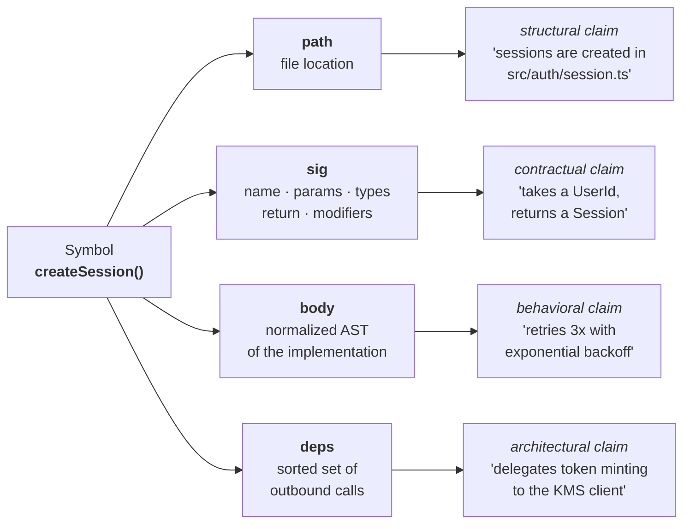
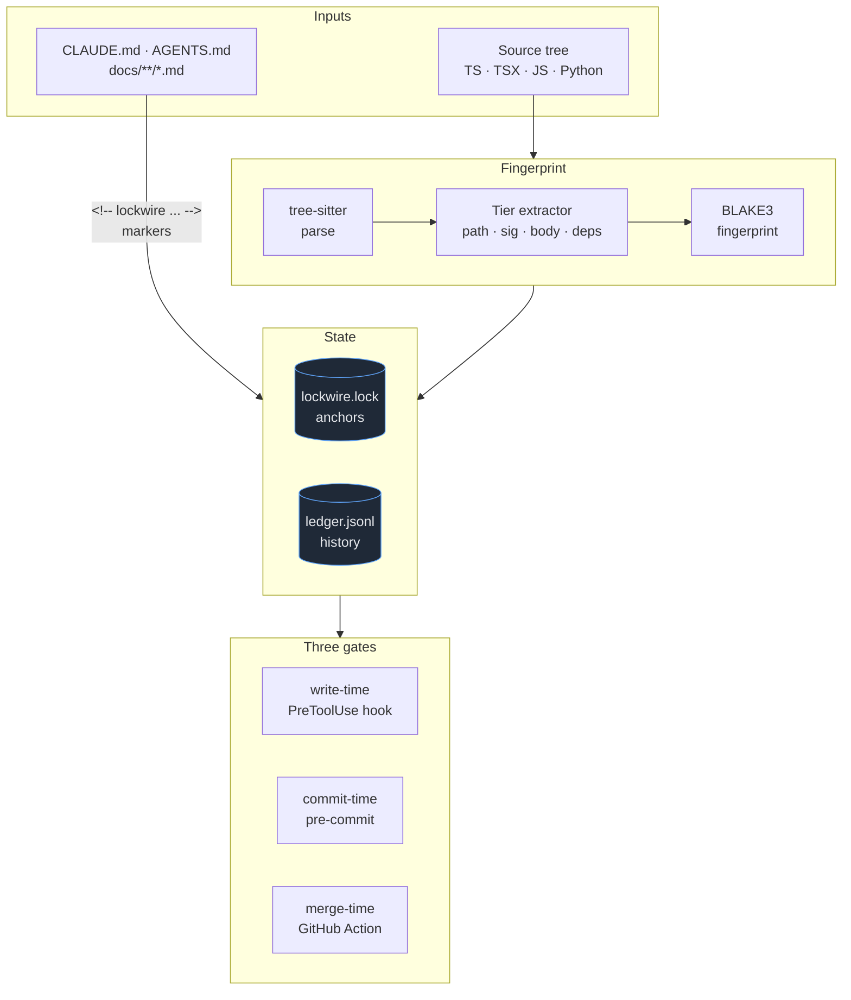
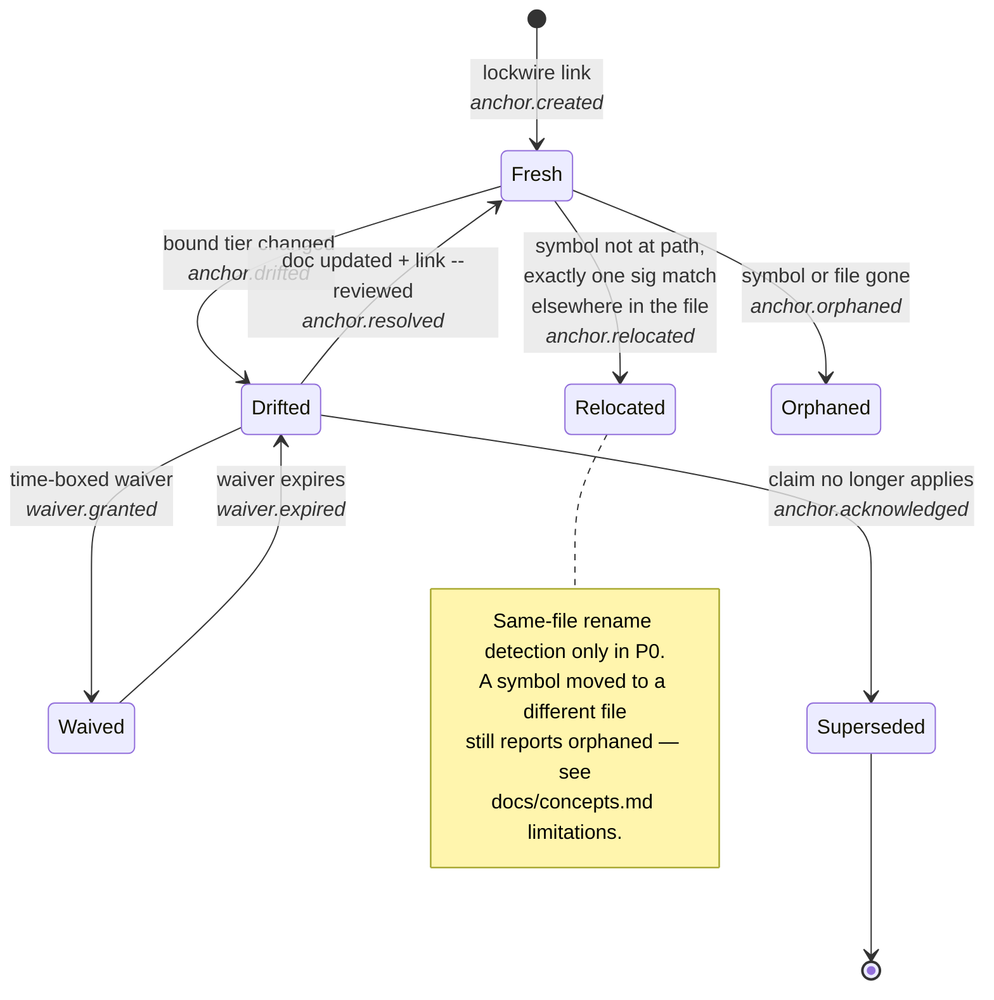
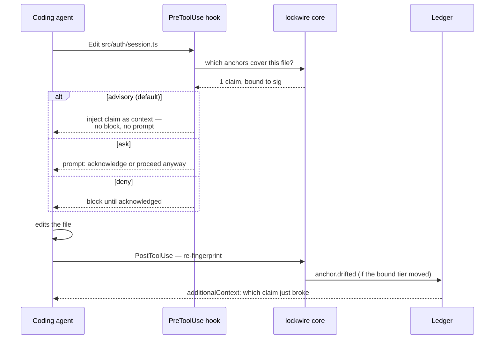

# lockwire

**Catch stale `CLAUDE.md`, `AGENTS.md`, and docs before your coding agent acts on them.**

[](https://www.npmjs.com/package/lockwire)
[](LICENSE)
[](https://code.claude.com/docs/en/plugins)
[](docs/agents.md)
[](docs/agents.md)
[](https://github.com/Reality-Ventures/lockwire/actions/workflows/ci.yml)

A sentence in your docs is a claim about a specific state of your code. Nothing binds the two together, so the claim rots and nobody notices — until an autonomous agent reads the stale sentence and acts on it. lockwire fingerprints the code a claim depends on, checks that fingerprint at write time inside Claude Code and Codex, and keeps a tamper-evident history of every time the claim broke.

```
$ lockwire check

CLAUDE.md
  DRIFTED   src/auth/session.ts#createSession (sig)
  ok        src/auth/provider.ts#AuthConfig

1 anchor · 1 ok · 1 drifted · 0 orphaned
single-hash would flag 1 · lockwire flagged 1 · noise −0%
```

```
$ lockwire history k7q2m9xv
2026-09-25T10:00:11Z  anchor.created
2026-09-25T14:12:03Z  anchor.drifted        sig  param `ttl: number` added
```

---

## The problem, specifically

1. **Coding agents change code faster than humans reconcile prose.** Drift that used to accumulate over quarters now accumulates over an afternoon.
2. **`CLAUDE.md` and `AGENTS.md` are read by an agent on every request.** A stale line doesn't just mislead a person reading it later — it silently redirects an autonomous process *right now*. Stale agent context is a correctness problem, not a hygiene problem.
3. **Wrong documentation is worse than no documentation.** Macke & Doyle (NAACL 2024) found that incorrect documentation "can greatly hinder" an LLM's ability to understand code, while missing documentation barely affects it at all — see [docs/research.md](docs/research.md). A confidently wrong `CLAUDE.md` is actively harmful in a way an empty one isn't.

And the tools built to fix this have a shared failure mode: **one hash per symbol.** Hash a whole function, and a one-line body tweak invalidates a doc that only ever claimed something about the *signature*. Teams get flooded with false staleness, the CI gate gets marked `continue-on-error`, and the tool gets uninstalled. This is the specific failure lockwire is built to not have.

## How it's different

lockwire fingerprints **four aspects of a symbol separately**, and a claim only binds the aspects it actually depends on:



*A contractual claim binds only `sig` — a body refactor never touches it. This is the whole mechanism.*

A doc claiming "takes a `UserId`, returns a `Session`" binds `sig` only, and stays silent through every internal refactor of `createSession`. The [P0 test suite](test/e2e.test.ts) proves this on a real example: a body-only edit that adds a logging call produces **zero** drifted anchors and a noise line reading `single-hash would flag 1 · lockwire flagged 0 · noise −100%`.

## System view



## Anchor lifecycle



## Write-time enforcement



## Install

**Claude Code** — hook, MCP server, and skill in one plugin:

```bash
/plugin marketplace add Reality-Ventures/lockwire
/plugin install lockwire@lockwire
```

**Codex, Cursor, Gemini CLI, and other agents that read `SKILL.md`** — the skill only; wire up the hook and MCP server per your agent (see [docs/agents.md](docs/agents.md)):

```bash
npx skills add Reality-Ventures/lockwire
```

**CLI and CI** — no agent required:

```bash
npm i -g lockwire
# or: npx lockwire check
```

**GitHub Action** — merge-time gate:

```yaml
- uses: Reality-Ventures/lockwire@v0
  with:
    args: --changed
```

**pre-commit** — commit-time gate:

```bash
lockwire check --changed
```

## Quickstart

```bash
$ lockwire init
lockwire initialized: lockwire.lock, .lockwire/config.json, .gitattributes (ledger merge=union)
```

Add a marker above a claim in `CLAUDE.md`:

```markdown
<!-- lockwire src/auth/session.ts#createSession sig -->
`createSession` takes a `UserId` and returns a `Session` valid for 24 hours.
```

```bash
$ lockwire link CLAUDE.md
CLAUDE.md: 1 created, 0 refreshed
```

The marker is now stamped with an id:

```markdown
<!-- lockwire src/auth/session.ts#createSession sig id=k7q2m9xv -->
```

Refactor the function's body without touching its signature, then check:

```bash
$ lockwire check
CLAUDE.md
  ok        src/auth/session.ts#createSession

1 anchor · 1 ok · 0 drifted · 0 orphaned
single-hash would flag 1 · lockwire flagged 0 · noise −100%
```

Now change the actual signature (add a parameter) and check again:

```bash
$ lockwire check
CLAUDE.md
  DRIFTED   src/auth/session.ts#createSession (sig)

1 anchor · 0 ok · 1 drifted · 0 orphaned
single-hash would flag 1 · lockwire flagged 1 · noise −0%
```

Update the doc, then re-stamp — `--reviewed` is required because this anchor is currently `drifted`:

```bash
$ lockwire link CLAUDE.md --reviewed
CLAUDE.md: 0 created, 1 refreshed
```

And ask what happened, whenever, from anyone:

```bash
$ lockwire history k7q2m9xv
2026-09-25T10:00:11Z  anchor.created
2026-09-25T14:12:03Z  anchor.drifted        sig  param `ttl: number` added
2026-09-25T14:15:40Z  anchor.resolved
```

Inside Claude Code, the hook does this automatically — before the edit, you'd see the claim injected as context; after, you'd see exactly which claim just drifted, with no `check` invocation needed. See [docs/agents.md](docs/agents.md) for the injected text.

## What lockwire does not do

Hashes cannot catch semantic drift — a doc saying "we use Redux" when the code moved to Zustand, where every file path still resolves and no signature changed. Catching that requires reasoning about meaning, not fingerprints; [ClaudeDrift](https://github.com/marky291/claude-drift) does this well as an on-demand, LLM-reasoning layer, and pairs naturally with lockwire's continuous, deterministic one — see [docs/comparison.md](docs/comparison.md). P0 supports TypeScript, TSX, JavaScript, and Python; cross-file rename detection, a resolver agent, and semantic-claim extraction are roadmap, not shipped — see [docs/concepts.md](docs/concepts.md#limitations).

## FAQ

### How is this different from fiberplane/drift?

[fiberplane/drift](https://github.com/fiberplane/drift) computes one AST hash per anchor — a body refactor invalidates a doc that only claimed something about the signature. lockwire fingerprints path, signature, body, and dependencies separately, so a claim only re-flags when the aspect it actually depends on changes. Neither fiberplane/drift nor any other tool we found keeps a history of *why* a claim broke, *who* broke it, or *how often* — lockwire's ledger does. See the full comparison in [docs/comparison.md](docs/comparison.md).

### Does it call an LLM?

No. Detection is deterministic: tree-sitter parsing, BLAKE3 hashing, set comparison. No network calls, no API keys, no per-check cost. The write-time hook and CLI both run entirely offline.

### Will it slow down Claude Code?

The hook has a 10-second timeout and only re-parses the one file that was just touched — in practice, well under a second for typical files. It fails open: if anything throws, the hook exits silently and the tool call proceeds untouched. See [docs/agents.md](docs/agents.md).

### What happens on merge conflicts in the ledger?

`.lockwire/ledger.jsonl` is append-only JSONL with `merge=union` in `.gitattributes` (written by `lockwire init`), so `git merge` unions the lines from both branches instead of conflicting. Event hashes don't chain to a previous event, deliberately — the ledger's tamper-evidence is order-independent (a BLAKE3 root over the *set* of event hashes), because ordering is already supplied by each event's timestamp and commit SHA. See [docs/ledger.md](docs/ledger.md).

### Can I use it without Claude Code?

Yes. The core is a standalone CLI (`lockwire check`, `lockwire link`, …) that runs anywhere Node runs — in a pre-commit hook, in any CI system, or by hand. Claude Code and Codex hooks are two of several ways to trigger it; the GitHub Action is a third.

### What languages are supported?

TypeScript, TSX, JavaScript, and Python in P0 (v0.1.0). More tree-sitter grammars are a small addition on top of the existing tier-extraction pipeline — see [docs/concepts.md](docs/concepts.md).

### Why not just use an LLM to check everything?

Because then every `check` costs money and time, becomes non-deterministic, and can't run inside a 10-second write-time hook. lockwire's deterministic core handles the mechanical 80% (does this claim's bound aspect still match); an LLM-reasoning layer for the harder semantic 20% is a natural P2 addition, not a P0 requirement — see [docs/research.md](docs/research.md) for why teams abandon LLM-only or hash-flood-prone tools.

## Comparison

| | lockwire | [fiberplane/drift](https://github.com/fiberplane/drift) | [ClaudeDrift](https://github.com/marky291/claude-drift) | [pallaprolus/drift](https://github.com/pallaprolus/drift) |
|---|---|---|---|---|
| Fingerprint granularity | 4 tiers per symbol | 1 hash per anchor | none (LLM judgment) | 1 score per doc-code pair |
| Write-time agent hook | ✅ Claude Code + Codex | ❌ | ❌ (on-demand) | ❌ |
| History / ledger | ✅ append-only, tamper-evident | ❌ | ❌ | ❌ |
| Semantic drift (meaning changed, refs still resolve) | ❌ (roadmap) | ❌ | ✅ | ✅ (opt-in, on-demand) |
| Runs with no LLM | ✅ | ✅ | ❌ | ✅ (core checks) |
| Languages (P0) | TS, TSX, JS, Python | TS, Python, Rust, Go, Zig, Java | any (LLM-read) | TS/JS, Python, Go, Rust, Java |

Full detail, including two smaller entrants and where each tool actually stops, in [docs/comparison.md](docs/comparison.md).

## Documentation

- [docs/concepts.md](docs/concepts.md) — tiers, anchors, claims, drift, and the current limitations
- [docs/cli.md](docs/cli.md) — full command reference
- [docs/agents.md](docs/agents.md) — Claude Code plugin, Codex, MCP tools, hook payloads, other agents via skills
- [docs/ledger.md](docs/ledger.md) — the append-only ledger, union merge, Agent Trace actors, verification
- [docs/comparison.md](docs/comparison.md) — the full competitive comparison
- [docs/research.md](docs/research.md) — the evidence base this design is built on

## Contributing

See [CONTRIBUTING.md](CONTRIBUTING.md). Security issues: see [SECURITY.md](SECURITY.md), not a public issue.

## License

[MIT](LICENSE)
